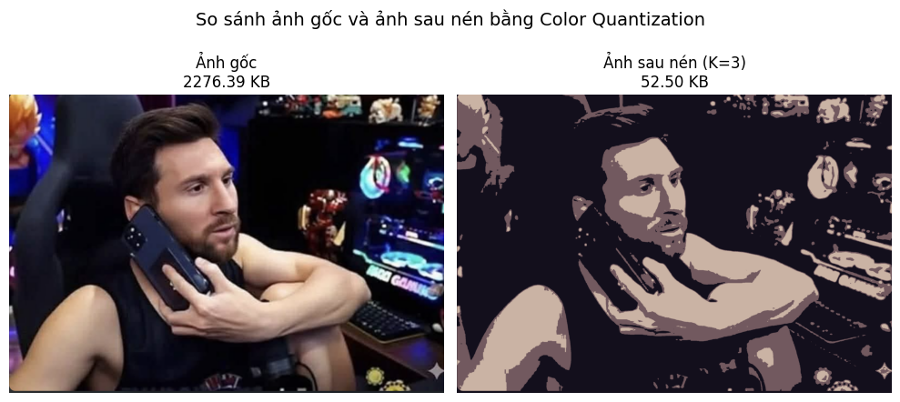
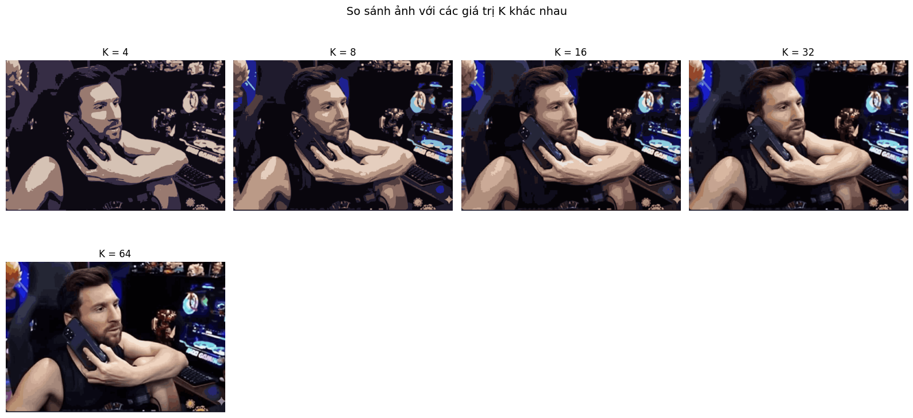
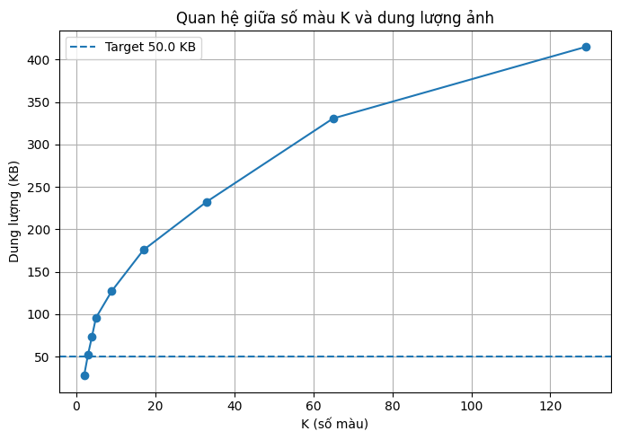

# Giảm Dung Lượng Ảnh bằng K-Means Color Quantization

## Mục tiêu dự án
Dự án giảm kích thước tệp ảnh bằng cách giảm số lượng màu sắc sử dụng. Phương pháp K-Means clustering trên không gian màu RGB được áp dụng để gom các pixel vào **K** cụm màu và thay thế mỗi pixel bằng centroid của cụm đó, giúp giảm dung lượng ảnh mà vẫn giữ được chất lượng thị giác.

## Ví dụ minh họa (Input/Output)


## Quy trình thực hiện
1. Đọc ảnh – Tải ảnh input (ví dụ `input.png`) bằng Pillow và chuyển thành mảng NumPy dạng `(H, W, 3)`.
2. Chuẩn hóa dữ liệu – Chuyển ảnh thành dạng 2D `(num_pixels, 3)` để thuận tiện cho K-Means.
3. Áp dụng K-Means – Dùng `sklearn.cluster.KMeans(k)` để phân cụm màu.
4. Tái tạo ảnh – Thay mỗi pixel bằng màu centroid của cụm tương ứng.
5. Lưu ảnh đầu ra – Xuất file mới (ví dụ `output_quantized.png`).

## So sánh với K khác nhau


## Thuật toán tối ưu K theo dung lượng ảnh mục tiêu
Ngoài việc chọn K thủ công, dự án hỗ trợ tự động tìm số cụm **K** tối ưu sao cho kích thước ảnh sau nén gần nhất với dung lượng mục tiêu. Dung lượng ảnh giảm dần khi K nhỏ và tăng khi K lớn, vì vậy có thể dùng tìm kiếm nhị phân trên K.

### Thuật toán cơ bản
- Input: ảnh gốc, `target_size_kb`, giới hạn `K` tối thiểu và tối đa (ví dụ `2 <= K <= 64`).
- Tìm kiếm nhị phân: ở mỗi bước, chọn `mid = (low + high) // 2`, nén ảnh với K=mid, đo dung lượng file tạm thời, so sánh với `target_size_kb` và điều chỉnh khoảng tìm kiếm.
- Trả về giá trị K có sai khác dung lượng nhỏ nhất.

```python
def search_optimal_k(image_array, target_size_kb, k_min=2, k_max=64):
    low, high = k_min, k_max
    best_k = None
    best_diff = float("inf")

    while low <= high:
        mid = (low + high) // 2
        img_mid = quantize_image_kmeans(image_array, mid)
        save_image(img_mid, "temp.png")
        size_mid = os.path.getsize("temp.png") / 1024

        diff = abs(size_mid - target_size_kb)
        if diff < best_diff:
            best_diff = diff
            best_k = mid

        if size_mid > target_size_kb:
            high = mid - 1
        else:
            low = mid + 1

    return best_k
```

## Quan hệ giữa K và dung lượng


## Hướng dẫn cài đặt và sử dụng

### Cài đặt thư viện
```bash
pip install numpy matplotlib scikit-learn pillow
```

### Chạy script nén ảnh cơ bản
```bash
python main.py --input input.png --k 16 --output output_quantized.png
```

### Chạy chế độ tìm K tối ưu theo dung lượng
```bash
python main.py --input input.png --target_size 150 --output compressed.png
```

## Cải tiến đề xuất
- Thử nghiệm không gian màu Lab để phản ánh tốt hơn cảm nhận thị giác.
- Sử dụng MiniBatchKMeans cho ảnh lớn để giảm thời gian tính toán.
- Đánh giá chất lượng nén bằng các chỉ số PSNR/SSIM để lựa chọn K.
